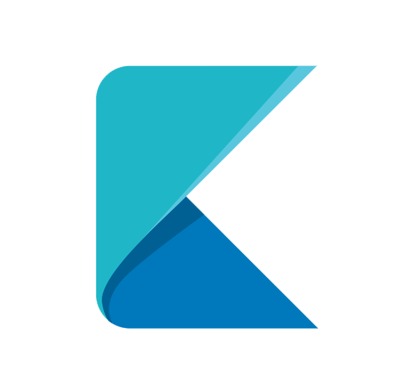

## Getting Started

The project uses the Github API and utilizes the browser's localStorage for persistence. The following instructions will give you a copy of the project on your local machine for development and testing purposes.

### Prerequisites

Make sure you have NodeJS (v9.0 or higher) and npm (v5.6.0 or higher) installed.

### How to build

1.  Clone the repo.
2.  Install all dependencies using `npm install`.
3.  Start the project by running `npm start`.

### Prettier and Precommit Hooks

Prettier is used for automatic code formatting. It's executed on every commit using a precommit hook.

## Roadmap

- [ ] Add tests
- [ ] Integrate Typescript
- [ ] **_Current Project page_** - a page with a detailed information of my current work in progress project
- [ ] **_Issues Page_** - a social page with all open issues of all my projects listed, where people can give suggestions and propose solutions

## Deployment

The continuous deployment is done using Netlify.

## Contributing

Pull Requests and Suggestions are highly recommended. Use the [issues](https://github.com/KleoPetroff/react-github-portfolio/issues) section to submit a suggestion or report an issue or submit a [pull request](https://github.com/KleoPetroff/react-github-portfolio/pulls).

## License

This project is licensed under the MIT License - check the [LICENSE](https://github.com/KleoPetroff/react-github-portfolio/blob/master/LICENSE) for details.
